# SOLUCIÓN
## PREVIO
- antes de empezar a desarrollar el proyecto, en clase se indicó que se debería poder realizar cualquier instrucción de docker sin usar sudo antes de cada instrucción o ingresar al usuario root, por lo que se configura el sistema.
```bash
# para añadir usuario del sistema al grupo docker
  sudo usermod -aG docker $USER
# para cerrar sesión y se actualice los cambios
  newgrp docker
```
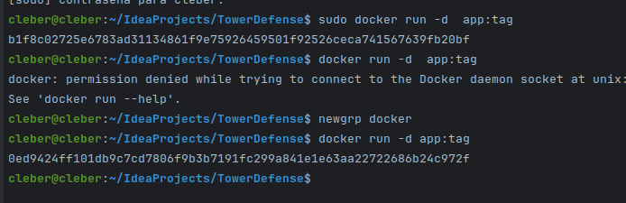
## EJERCICIO 01
#### TEORÍA

1. Describe los principios fundamentales de los contenedores Docker y su arquitectura interna. Explica cómo Docker maneja la seguridad y el aislamiento de contenedores
- Principios fundamentales Docker
    - `Empaquetamiento`: Docker encapsula app y sus dependencias en contenedores (ligeros) para ejecutarse independientemente.
    - `Portabilidad`:se puede ejecutar desde cualquier ordenador sin importar las diferencias en infraestructura.
    - `Aislamiento`: Cada contenedor ejecuta una aplicación de manera aislada, usando recursos del SO subyacente controladamente.
    - `Eficiencia`: Utilizan recursos de manera eficiente pues solo usar recursos y librerías necesarios para la aplicación específica.
    - `Escalabilidad` y `distribución`: Facilitan la escala horizontal al poder replicar contenedores de manera rápida y sencilla.

- Seguridad y Aislamiento:  Docker utiliza `namespaces` para proporcionar aislamiento a nivel de sistema operativo, limitando las vistas de otros recursos del sistema. Además, el `control Groups` limita y controla los recursos que un contenedor puede utilizar.

2. Docker vs. Virtualización Tradicional (se mencionan algunos puntos)

característica | Docker | Virtualización
---------------|--------|------------------
eficiencia | Docker comparte el núcleo del sistema operativo del host, lo que reduce el overhead | tiene un núcleo, SO indipendiente, por lo que tiene un alto overhead
Portabilidad y time Despliegue | Docker permite un despliegue más rápido y portabilidad debido a la estandarización de contenedores | lentas de desplegar y menos portátiles debido a las diferencias en configuraciones de hardware y software
Aislamiento | Docker comparte el kernel del host y utiliza namespaces y cgroups para el aislamiento | Las VMs proporcionan aislamiento más fuerte ya que cada una tiene su propio kernel y recursos completamente separados
Seguridad | al compartir host, debe estar configurado correctamente, poque de lo contrario todo estaría expuesto | cada uno puede tener su nivel de seguridad y en caso de vulnerar uno los otros no quedarían expuestos inmediantamente

overhead: recursos adicionales que se requiere para realizar una tarea más allá de lo escencias
ivo completo.
    : , mientras que las VMs pueden ser más lentas de desplegar y menos portátiles debido a las diferencias en configuraciones de hardware y software.
    Aislamiento: , mientras que .

#### PRÁCTICA

1. Escribe un Dockerfile para la aplicación Tower Defense que incluya la instalación de todas las dependencias necesarias. Asegúrate de optimizar el Dockerfile para reducir el tamaño de la imagen final
- Dockerfile con instalación de dependencias (imagen reducida)
  - construir la imagen
  ```bash
  FROM openjdk:17
  WORKDIR /app
  COPY . .
  RUN javac src/main/java/org/example/*.java
  CMD ["java", "-cp", "src/main/java", "org.example.Game"]
  ```
  ```bash
  docker build -t tower-defense-game .
  ```
  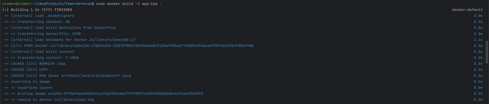
  ```bash
  docker images
  ```
  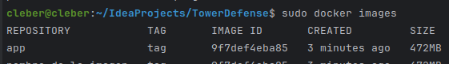
    - mejoramos la imagen para reducirla. Se comenta los cambios
  ```bash
  # estamos utilizando openjdk17, por lo que buscaremos su versión light 
  FROM openjdk:17-slim as build
  WORKDIR /app
  # Solo copiamos los archivos necesarios: gradles(configuraciones) y src(proyecto). evitamos las configuraciones propias del IDEA-PROYECT
  COPY gradlew .      
  COPY gradle gradle
  COPY build.gradle .
  COPY settings.gradle .
  COPY src src
  # permisos gradle
  RUN chmod +x ./gradlew
  RUN ./gradlew build
  # Inicia una nueva etapa desde cero para solo mantener ejecutable RUN
  FROM openjdk:17-slim
  WORKDIR /app
  # lo volvemos ejecutable el proyecto
  COPY --from=build /app/build/libs/*.jar ./app.jar
  CMD ["java", "-jar", "app.jar"]
  ```
    - verificamos que sea una imagen mejor
  ```bash
  docker build -t app:tag .
  docker images
  ```
  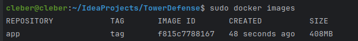
2. Construye y ejecuta el contenedor Docker utilizando el Dockerfile creado. Utiliza docker exec
para acceder al contenedor y verificar que la aplicación funcione correctamente
- para el caso de la imagen no reducida
  ```bash
  docker run --rm -it --name tower-defense-container tower-defense-game
  ```
  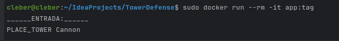
  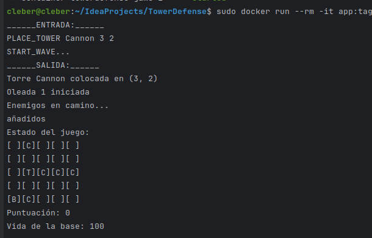

  docker-compose
  ```bash
  docker-compose up -d
  ```
  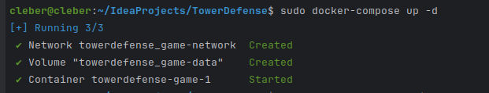
- ṕara el caso del a imagen reducida (jar)
  - primero debemos configurar build para que se pueda ejecutar el archivo .jar
  ```groovy
  //build.gradle
  jar {
    manifest {
        attributes(
                'Implementation-Title': 'Tower Defense Game',
                'Implementation-Version': version,
                // nombre de la clase principal
                'Main-Class': 'com.example.Game'
        )
    }
}
  ```
  ```bash
  # si se tiene otro contenedor con el mismo nombre se borra
  docker rm -f my-towerdefense-container
  # ejecutar contenerdor
  docker run -d --name my-towerdefense-container app:tag
  ```
  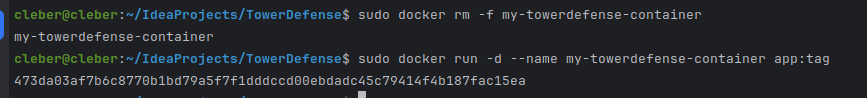

  - mostramos el contenedor
  ```bash
  docker exec -it tower-defense-container /bin/bash
  ```
  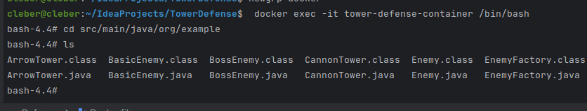
- interacción entre diferentes contenedores
  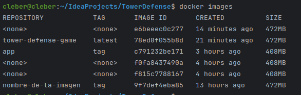
  - primero:
  ```bash
  # creamos una red
  docker network create tower-defense-net
  docker network ls
  ```
  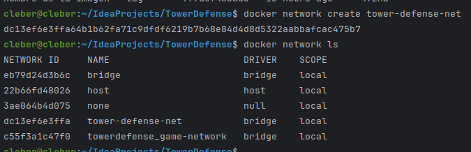
  - creamos docker-compose.yml
  ```bash
  version: '3'
  services:
    game:
      image: app:tag
      networks:
        - game-network
      volumes:
        - game-data:/app/data
    game_:
      image: tower-defense-net
      networks:
        - game-network
      volumes:
        - game-data:/app/data
  networks:
    game-network:
      driver: bridge
  volumes:
    game-data:
      driver: local
  ```
  - ejecutamos 
    ```bash
    docker-compose up -d
    ```
    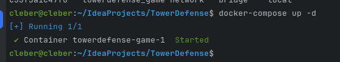

## EJERCICIO 02
#### TEORÍA
1. Explica en detalle cómo Docker maneja las redes y los volúmenes. Discute los diferentes tipos de redes (bridge, host, overlay) y cuándo es apropiado usar cada una.
- cómo Docker maneja las redes y los volúmenes
    - Docker maneja redes y volúmenes para permitir la configuración flexible de contenedores, facilitando su comunicación y el manejo de datos
    - `Redes`: Docker utiliza un sistema de redes para permitir que los contenedores se comuniquen entre sí y con el mundo exterior gracias a los `Driver de red predeterminado` que crea una red privada interna en el host, `Redes definidas por el usuario`, `Puertos` para mapear puertos entre el contenedor y el host, facilitando el acceso a los servicios 
    - `Volúmenes`: Los volúmenes en Docker son la manera recomendada de manejar datos persistentes generados por y utilizados por los contenedores de Docker gracias a que cuenta con la persistencia de datos, almacenamiento independiente, compartir datos y drivers.
- diferentes tipos de redes (bridge, host, overlay) y cuándo es apropiado usar cada una.

tipo red | características | uso adecuado
-------|-|-
bridge | - Red privada dentro del host.<br>- Los contenedores se comunican a través de una interfaz virtual. | - Ideal para aplicaciones en un solo host donde se necesita que los contenedores se comuniquen entre sí.<br>- Bueno para entornos de desarrollo y pruebas.
host | - Elimina el aislamiento de red entre el contenedor y el host Docker.<br>- Usa directamente la red del host. | - Útil cuando el contenedor necesita un acceso de red de alto rendimiento o no requiere el aislamiento de red proporcionado por bridge.
overlay | - Permite la comunicación entre contenedores en diferentes hosts.<br>- Usa redes virtuales que abarcan múltiples hosts. | - Necesario para aplicaciones distribuidas que se ejecutan en clusters de Docker en diferentes hosts.<br>- Adecuado para aplicaciones en producción a escala.
2. Describe los mecanismos de persistencia de datos en Docker, incluyendo volúmenes y bind
mounts. Explica las diferencias entre ellos y las mejores prácticas para su uso. 

| Mecanismos de persistencia | Descripción | Diferencias | Mejores prácticas |
|-|-|-|-|
| **Volúmenes**              | Almacenamiento gestionado por Docker, localizado en una parte del sistema de archivos del host, pero completamente gestionado y manipulado por Docker.       | - Los volúmenes son gestionados por Docker.<br>- No necesitan existir en el host antes de su uso.                        | - Usar volúmenes cuando se necesita persistencia de datos entre múltiples despliegues de contenedores.<br>- Más seguros y portátiles. |
| **Bind mounts**            | Un mapeo directo de un directorio o archivo específico en el host dentro del contenedor. Los datos existen fuera del ciclo de vida del contenedor.            | - Los bind mounts dependen de la estructura del sistema de archivos del host.<br>- Pueden afectar el sistema de archivos del host. | - Usar para necesidades específicas de acceso a archivos del sistema o para configuraciones específicas del entorno de desarrollo.   |

#### PRÁCTICA
1.  Crea una red personalizada para el proyecto Tower Defense y configura los contenedores
  - crear red con `docker network create game-network`
  - definir contenedores con 
  ```bash
  version: '3'
  services:
    database:
      image: postgres:12
    game:
      image: app:tag
      networks:
        - game-network

      volumes:
        - game-data:/app/data
  networks:
    game-network:
      driver: bridge

  ```
  - muestra resultados
  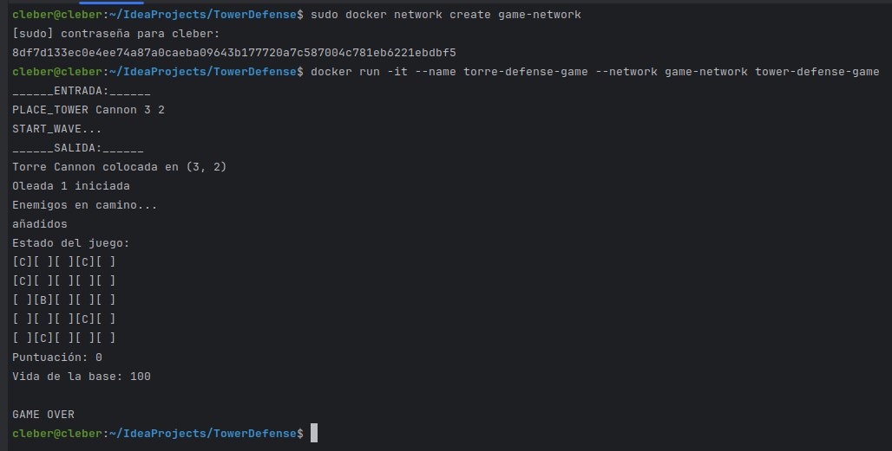
  - construir y corre contenedores
  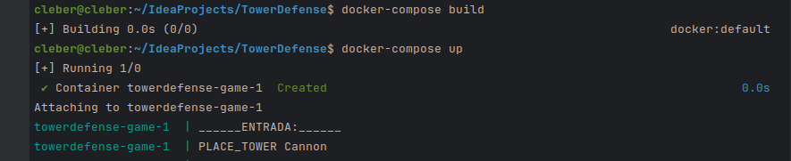

2. Implementa un volumen Docker para almacenar los datos del juego de forma persistente. Asegúrate de que el volumen se monte correctamente y que los datos persistan después de reiniciar el contenedor.
  - añado una sección `volumes` para definir un volumen en la raíz del archivo docker-compose.yml y además se almacena en postgrest
  ```bash
  version: '3'
  services:
    database:
      image: postgres:12
    game:
      image: app:tag
      networks:
        - game-network

      volumes:
        - game-data:/app/data
  networks:
    game-network:
      driver: bridge
  volumes:
    game-data:
      driver: local

  ```
  - persistencia
  ```bash
  docker-compose up -d
  docker-compose stop database
  docker-compose start database
  ```
  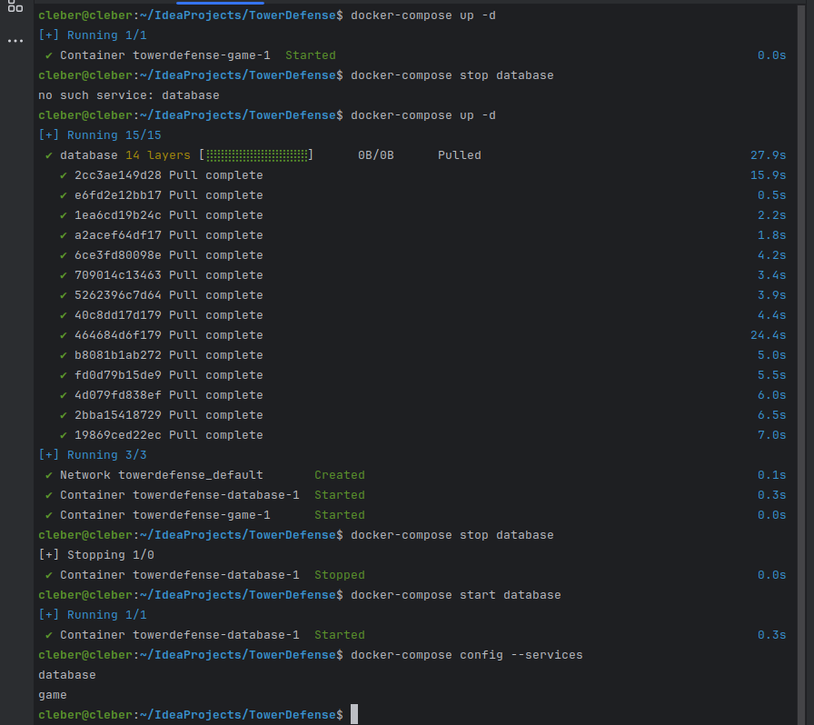
3. Utiliza docker-compose para definir los servicios de la aplicación Tower Defense, incluyendo redes y volúmenes. Escribe un archivo docker-compose.yml que configure estos servicios y despliega la aplicación utilizando Docker Compose.
  - ya se hicieron todas las cconfiguraciones en las secciones anteriores por lo que solo se demostrará la ejecución
  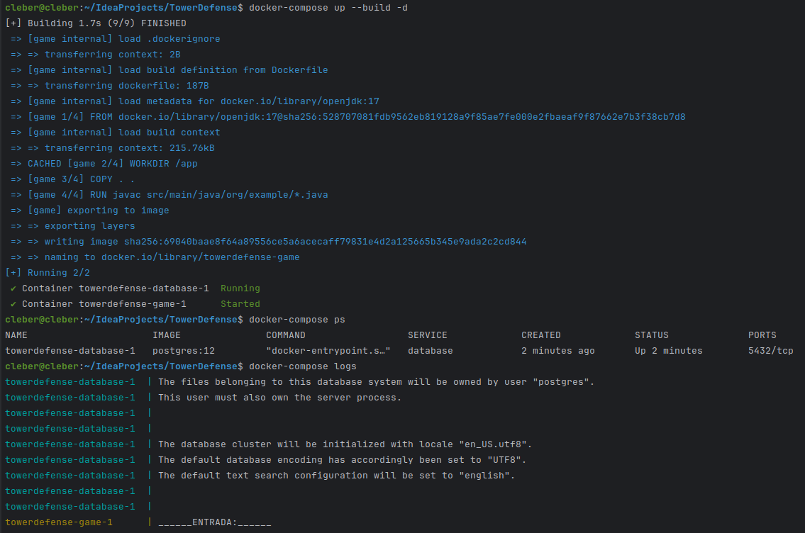

  ## EJERCICIO 03
#### TEORÍA
- Describe la arquitectura de Kubernetes y sus componentes principales, incluyendo el API server, etcd, scheduler, y kubelet. Explica cómo estos componentes interactúan para
gestionar un clúster de Kubernetes.
 - Discute las estrategias de escalabilidad y alta disponibilidad en Kubernetes. Explica cómo Kubernetes maneja la recuperación de fallos y la gestión de réplicas.
1. Arquitectura de Kubernetes:
  - API Server: Interfaz central para todas las operaciones del clúster.
  - etcd: Almacena la configuración y el estado del clúster
  - Scheduler: Decide en qué nodo se ejecutarán los pods según capacidades
  - Kubelet: Ejecuta y supervisa los contenedores en cada nodo.
2. Componentes Interactúan Así:
  - API Server procesa solicitudes y comunica el estado a etcd.
  - Scheduler observa nuevos pods a través del API Server y asigna nodos para su ejecución.
  - Kubelet asegura que los pods asignados estén corriendo correctamente.
3. Escalabilidad y Alta Disponibilidad:
  - Horizontalmente (ajustando número de pods) y verticalmente (ajustando recursos por pod).
  - Alta disponibilidad a través de replicas de componentes clave y reasignación de pods en fallo de nodos.
4. Recuperación de Fallos y Gestión de Réplicas:
  - Pods: ReplicaSet crea o elimina pods según la configuración deseada.
  - Nodos: En fallo de nodos, los pods se reprograman automáticamente en otros nodos.
  - Datos: StatefulSets manejan aplicaciones con estado que requieren persistencia.
#### PRÁCTICA
1. Escribe un archivo deployment.yaml para la aplicación Tower Defense. Asegúrate de definir los recursos necesarios (CPU, memoria) y las políticas de escalabilidad. `desployment.yaml`
```ỳaml
  apiVersion: apps/v1
  kind: Deployment
  metadata:
    name: tower-defense-deployment
  spec:
    replicas: 1
    selector:
      matchLabels:
        app: tower-defense-game
    template:
      metadata:
        labels:
          app: tower-defense-game
      spec:
        containers:
          - name: tower-defense-game
            image: game-image:latest
            ports:
              - containerPort: 8080
            resources:
              requests:
                cpu: "500m"
                memory: "256Mi"
              limits:
                cpu: "1"
                memory: "512Mi"
  ---
  apiVersion: autoscaling/v1
  kind: HorizontalPodAutoscaler
  metadata:
    name: tower-defense-hpa
  spec:
    scaleTargetRef:
      apiVersion: apps/v1
      kind: Deployment
      name: tower-defense-deployment
    minReplicas: 1
    maxReplicas: 5
    targetCPUUtilizationPercentage: 80

```
2.Implementa un Service en Kubernetes para exponer la aplicación Tower Defense a través de una IP pública. Utiliza un LoadBalancer para distribuir el tráfico entre múltiples réplicas de la aplicación. `Service.yaml`

```yaml
apiVersion: v1
kind: Service
metadata:
  name: tower-defense-service
spec:
  type: LoadBalancer
  ports:
    - port: 8080
      targetPort: 8080
      protocol: TCP
  selector:
    app: tower-defense-game

```
- comandos que se utilizaron 
```bash
  minikube start
  minikube status
  kubectl config view
  // desploy
  kubectl apply -f deployment.yaml
  // verificar desploy
  kubectl get deployments
  kubectl get pods
  //desplegar servicio
  kubectl apply -f service.yaml
  //verificar 
  kubectl get services
  //acceder a aplicación
  kubectl get service tower-defense-service
```
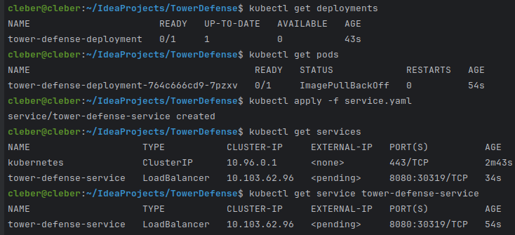

## EJERCICIO 04
#### PRÁCTICA
1. Escribe pruebas unitarias para la clase TowerDefenseGame utilizando Mockito para simular las dependencias de Map, Player y Wave.
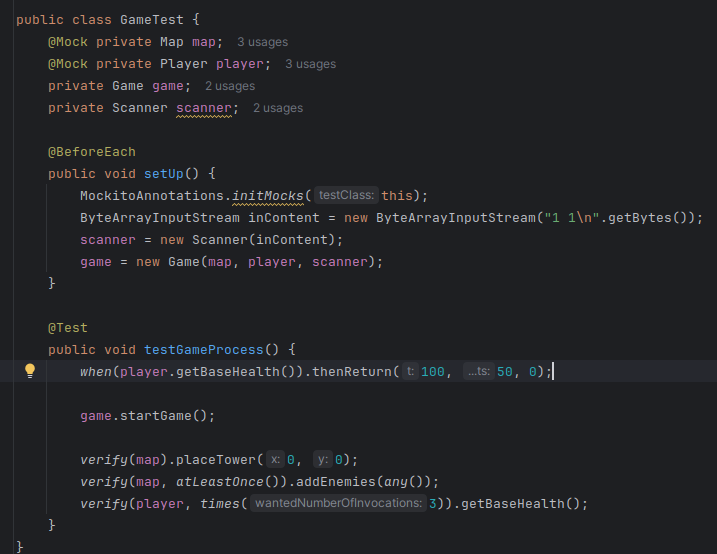
  - ejecución Game
  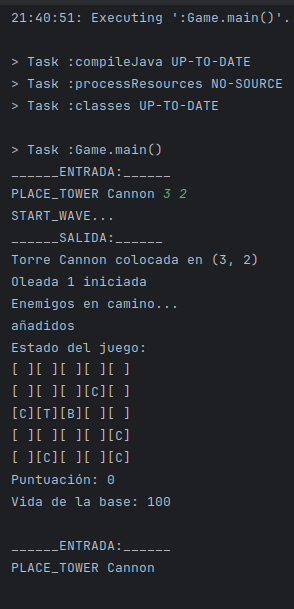
  - resultado Test
  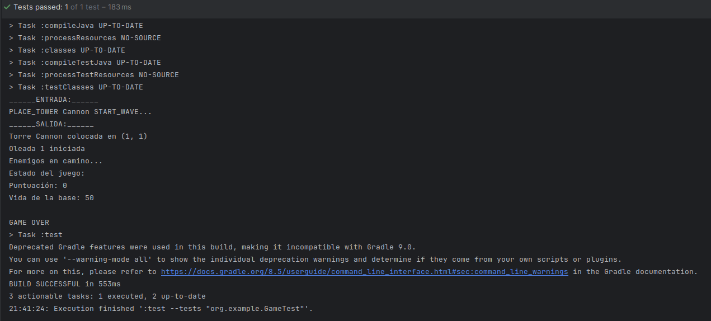

2. Implementa pruebas de integración que verifiquen la interacción entre las clases principales (TowerDefenseGame, Map, Player, Wave). Utiliza Mockito para controlar y verificar el comportamiento de las dependencias en estas pruebas.

  - codigo TEst
  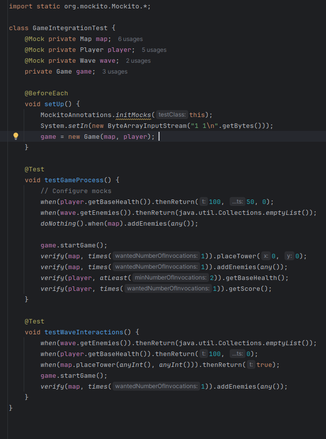
  - resultado Test
  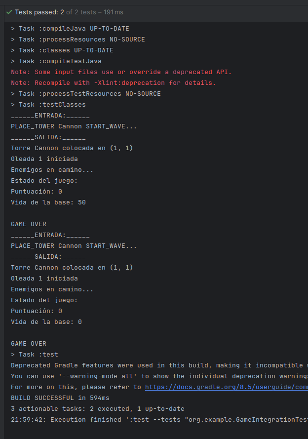

3. Configura un pipeline de integración continua (CI) que ejecute automáticamente las pruebas
unitarias e informe sobre los resultados. Utiliza herramientas como Jenkins o GitHub Actions
para implementar este pipeline (opcional).
